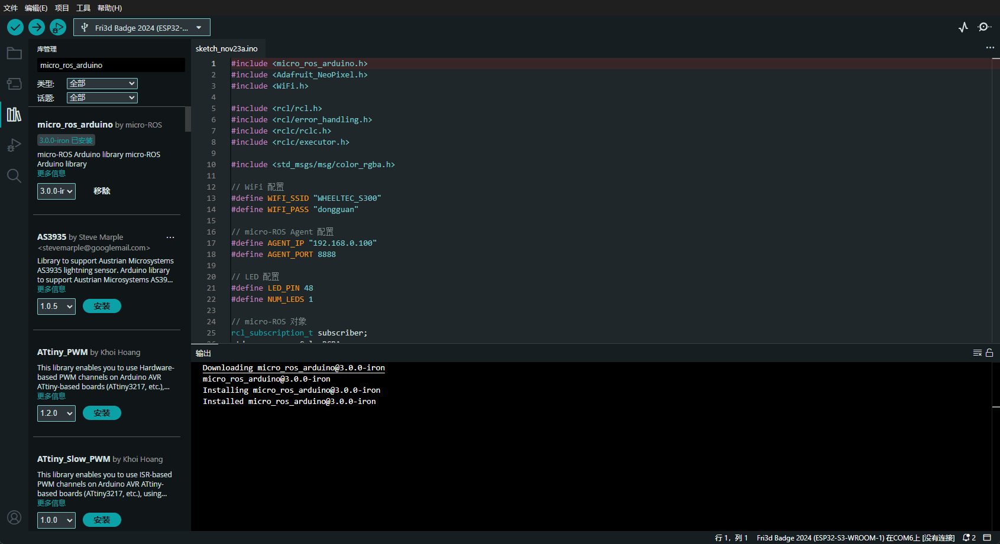

# micro-ros操作和使用
引言：本文是本人第一次接触micro-ros
参考链接<https://www.hackster.io/514301/micro-ros-on-esp32-using-arduino-ide-1360ca>
## 1.安装micro_ros客户端
```bash
cd
mkdir microros_ws
cd microros_ws
git clone -b humble https://github.com/micro-ROS/micro_ros_setup.git src/micro_ros_setup
# install rosdep
sudo apt install python3-rosdep2
sudo apt update && rosdep update
rosdep install --from-paths src --ignore-src -y
# install pip3
sudo apt-get install python3-pip
# colcon ROS2 Package
colcon build --symlink-install
source install/setup.zsh
# Run sh to create agent 
ros2 run micro_ros_setup create_agent_ws.sh
# colcon build agent
colcon build --symlink-install
```
## 2.在window端上安装Arduino IDE
### 1.安装micro_ros_arduino库
在库文件里面搜素micro_ros_arduino
出现这个点击安装

安装Adafruit_NeoPixel一样的思路
### 2.链接esp32将这段代码写给它
代码如下[ArduinoRGB.ino](./micro_ros/ArduinoRGB.ino)
注意：要修改文件夹esp32的名称修改为esp32s3，并且要修改为自己手机的Wi-Fi否则会一直闪红灯(因为Wi-Fi连接不上)
通过终端命令行输入
```powershell
ipconfig
```
得到我们的电脑链接手机的默认网关，就是我们手机的热点地址，然后将这个地址填入代码中
然后进行下载
下载完成之后
## 3.在WSL上进行下一步操作

运行micro_ros_agent
```bash
cd ~/microros_ws
source install/setup.zsh
ros2 run micro_ros_agent micro_ros_agent udp4 -p 8888
```
## 4.连接上之后可以通过ros2 topic pub给我们的下位机发送指令
连接上的标志是LED变成绿色
```bash
# 红色
ros2 topic pub /led_color std_msgs/msg/ColorRGBA "{r: 1.0, g: 0.0, b: 0.0, a: 1.0}" 

# 绿色
ros2 topic pub /led_color std_msgs/msg/ColorRGBA "{r: 0.0, g: 1.0, b: 0.0, a: 1.0}" 

# 蓝色
ros2 topic pub /led_color std_msgs/msg/ColorRGBA "{r: 0.0, g: 0.0, b: 1.0, a: 1.0}" 

# 紫色
ros2 topic pub /led_color std_msgs/msg/ColorRGBA "{r: 0.5, g: 0.0, b: 0.5, a: 1.0}" 

# 白色
ros2 topic pub /led_color std_msgs/msg/ColorRGBA "{r: 1.0, g: 1.0, b: 1.0, a: 1.0}" 

# 橙色
ros2 topic pub /led_color std_msgs/msg/ColorRGBA "{r: 1.0, g: 0.5, b: 0.0, a: 1.0}" 

```
昨天在又写一个Servo的控制的程序
就是纯通过下位机也就是ESP32通过串口来控制舵机


