# 本文主要是来使用git clone 出来的一个urdf功能包，然后来操作moveit
参考链接：<https://zhuanlan.zhihu.com/p/1920253906883187153>
## 克隆包的命令
```bash
# 安装我们的Moveit组件
  sudo apt update
  sudo apt install ros-humble-moveit-setup-assistant
# 安装模型包
git clone -b humble https://github.com/UniversalRobots/Universal_Robots_ROS2_Description.git
```
## 构建包并且使用包
放在我们的根目录下啦
之后构建我们的包,并且source工作空间
```bash
colcon build --select-packages ur_description
source ./install/setup.zsh
# 生成静态urdf文件,禁用机器人控制，否则我们加载这个的时候会导致moveit崩溃
xacro urdf/ur.urdf.xacro ur_type:=ur5e name:=ur generate_ros2_control_tag:=false > ur5e_no_control.urdf
```
## 使用moveit工具
启动moveit工具,这个是moveit官方提供给我们的工具
```bash
ros2 launch moveit_setup_assistant setup_assistant.launch.py
```
### 之后弹出这个弹窗，让我们选择urdf文件

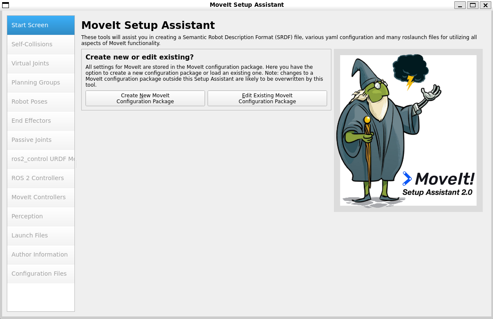

### 选择我们刚刚生成的urdf文件ur5e.urdf，之后点击Load按钮出现这个界面


### 下面我们就可以对moveit进行初始化啦点击self collisions 
选择generate collision matrix 创建碰撞矩阵


### 下一步添加虚拟关节，分成两种情况
#### 一种是固定底座的机器人 
这种不过多描述，可以设置也可以不设置
#### 一种是在小车等移动底座的机器人->点击add virtual joint
设置如下图所示


点击save进入下一步

### 添加计划组->点击add planning group
#### 添加运动链条选择基坐标系和末端坐标系
设置如图


#### 添加关节，修复完成之后


问题：使用moveit,现在使用WSL之后出现了闪退的情况,下面切换成树莓派试一下
为了接上这个的文件，我准备使用nfs挂载
# 在WSL上挂载这个目录
```bash
sudo apt update
sudo apt install nfs-kernel-server -y
# 配置/etc/exports 添加这两个目录作为共享目录
echo "/home/li/Universal_Robots_ROS2_Description *(rw,sync,no_root_squash,no_subtree_check)" | sudo tee -a /etc/exports
echo "/home/li/reference *(rw,sync,no_root_squash,no_subtree_check)" | sudo tee -a /etc/exports
# 添加这个配置
sudo exportfs -a && sudo systemctl restart nfs-kernel-server
# 检查nfs的状态
sudo exportfs -v
```
# 在树莓派上挂载这个目录
```bash
sudo apt update
sudo apt install nfs-common -y
# 创建挂载目录
mkdir -p ~/Universal_Robots_ROS2_Description
mkdir -p ~/reference
# 挂载
sudo mount 172.24.231.104:/home/li/Universal_Robots_ROS2_Description ~/Universal_Robots_ROS2_Description
sudo mount 172.24.231.104:/home/li/reference ~/reference
# 发现阻塞
```
结论：WSL不可以通过nfs来连接外部，因为这个虚拟IP只有主机Windows 11可以读取到，树莓派是读取不到的
# 在树莓派上重新运行上面的配置，但是我的树莓派是ROS-Jazzy，只需要将其他的改成ros-jazzy就可以啦
## 使用mobaxterm连接树莓派，发现还是出现这个问题，那就使用树莓派主机试一下
# 在树莓派主机上运行也不可以运行那我就排除了这个问题🤦‍♂️

# 又回到WSL的环境来进行使用
## 使用Franka Emilka Panda (Moveit官方的教程)
```bash
mkdir moveit_ws
cd moveit_ws
git clone -b humble https://github.com/ros-planning/moveit_resources.git
colcon build --symlink-install
source install/setup.zsh
ros2 launch moveit_setup_assistant setup_assistant.launch.py
```
路径选择~/moveit_ws/src/moveit_resources/panda_description/urdf/panda.urdf
但是还是出现这个问题，但是这个是ROS2官方提供的URDF文件，不知道为啥点击Load还是不可以进入内核，我不知道为啥？
### gemini给出的解决方案
```bash
export LIBGL_ALWAYS_SOFTWARE=1
export QT_XCB_GL_INTEGRATION=none
```
### 还是Load在70%的时候闪退，使用antigravity来修复
```bash
export LIBGL_ALWAYS_SOFTWARE=1 && source ~/moveit_ws/install/setup.zsh && /opt/ros/humble/lib/moveit_setup_assistant/moveit_setup_assistant --urdf_path ~/moveit_ws/src/moveit_resources/panda_description/urdf/panda.urdf
```
发现还是Load在70%的时候闪退
参考链接：
<https://blog.csdn.net/Cruelbuildingdog/article/details/153111900>
来试着解决一下这个问题
它给我们的思路比较暴力卸载rviz2降级rviz2的版本来进行操作，可能是rviz2的版本太高了
其中要处理一下rosdep的问题,因为这个问题和我遇见的问题一样
使用前做的准备工作
```bash
sudo apt update
sudo apt install python3-rosdep2
rosdep2 update
```
<font color="red">这里不得不吐槽一下编译速度了🤦‍♂️</font>
感觉超级慢
个人估计大概编译了1 hour，以前在jetson iron nano上使用虚拟内存可以加快编译速度。
扩展虚拟内存可以看这个文章[WSL](./wsl.md)
这样我们就可以加快编译速度啦
按照这个文章操作完之后，还是出现加载不出来的问题

```error
[ERROR] [moveit_setup_assistant-1]: process has died [pid 1357, exit code -11, cmd '/opt/ros/humble/lib/moveit_setup_assistant/moveit_setup_assistant --ros-args']
```
通过这个网站解决
<https://blog.csdn.net/weixin_46544694/article/details/151616523?ops_request_misc=%257B%2522request%255Fid%2522%253A%25221cfb6986c7c2e98ccd0d9d2a9aab7c49%2522%252C%2522scm%2522%253A%252220140713.130102334.pc%255Fblog.%2522%257D&request_id=1cfb6986c7c2e98ccd0d9d2a9aab7c49&biz_id=0&utm_medium=distribute.pc_search_result.none-task-blog-2~blog~first_rank_ecpm_v1~rank_v31_ecpm-1-151616523-null-null.nonecase&utm_term=%5BERROR%5D%20%5Bmoveit_setup_assistant-1%5D%3A%20process%20has%20died%20%5Bpid%201357%2C%20exit%20code%20-11%2C%20cmd%20%2Fopt%2Fros%2Fhumble%2Flib%2Fmoveit_setup_assistant%2Fmoveit_setup_assistant%20--ros-args%5D&spm=1018.2226.3001.4450>

问题可能在于mobaxtermde1x server可能影响了WSL到Windows 11的显示
只需要添加，为了防止我们忘记添加，给它添加到~/.zshrc里面

```bash
 export QT_QPA_PLATFORM=xcb
 ```
 就可以了🤦‍♂️，前面那么久都没有正确修正这个问题，看到这里直接跳到
 不知为什这个不可以UUniversal_Robots_ROS2_Description这个包还是不可以用，那我们就用ROS2官方提供给我们的包来运行
# 使用moveit_ws里的包来运行
## 1.生成碰撞矩阵(和上一个包类似)
## 2.添加虚拟关节
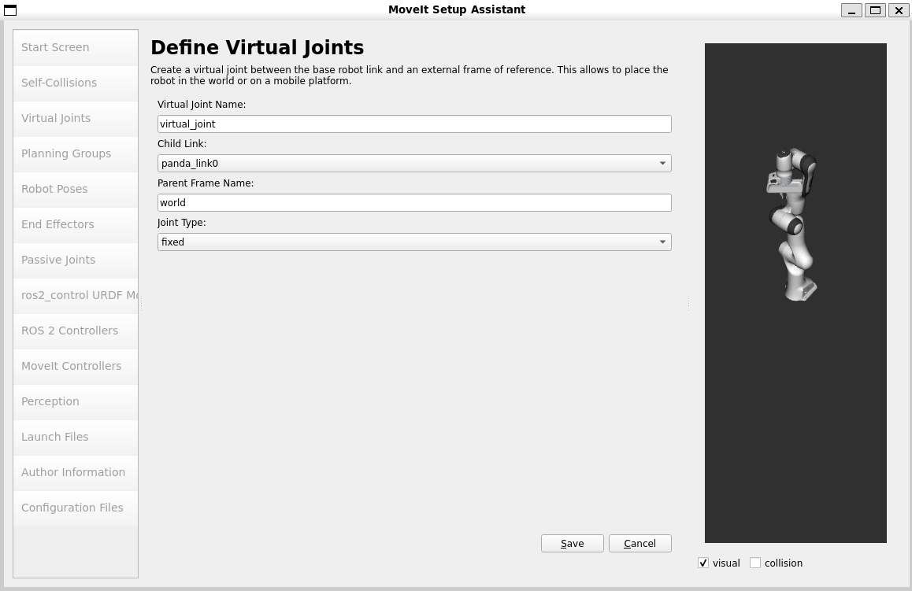
## 3.添加计划组(主要是添加关节)
下面是添加运动链条和关节的区别
### 添加运动链(Add Kin.Chain)和添加关节(Add joints)的区别：
#### 添加运动链：在机器人学中，运动链指的是从一个固定的基座到末端执行器之间的一系列通过关节连接起来的连杆。当你选择“添加运动链”时，你实际上是在定义一个从根节点到末端执行器的连续运动路径。这个选项允许你指定整个链条上的所有关节和连杆，这对于设置机械臂的整体运动范围非常有用。
#### 添加关节：关节是连接两个刚体（通常是连杆）的元素，允许它们相对于彼此移动。根据关节类型的不同（旋转关节、棱形关节等），它可以提供一维或多维的自由度。当你选择“添加关节”时，你关注的是单独的可动点，即单个关节，而不是一系列连杆和关节组成的完整链条。这种方式更适合于需要对某个特定关节进行详细配置的情况。
下面是配置关节的图片
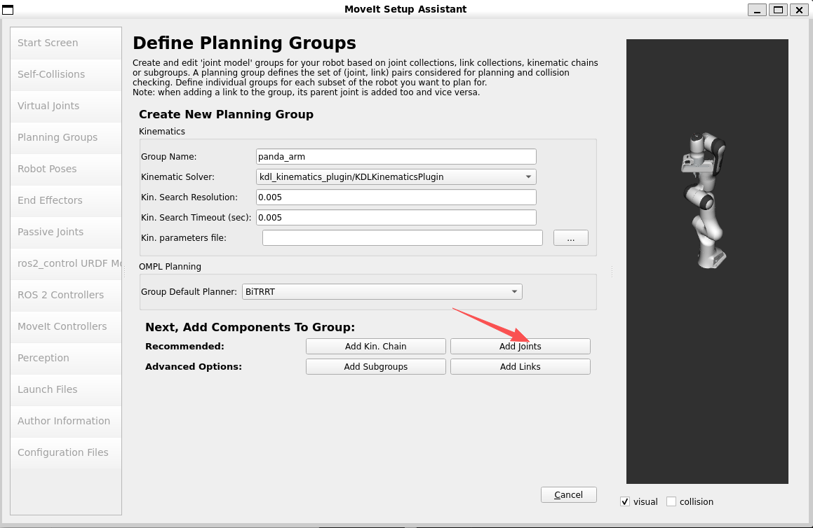
添加完成之后结果如下
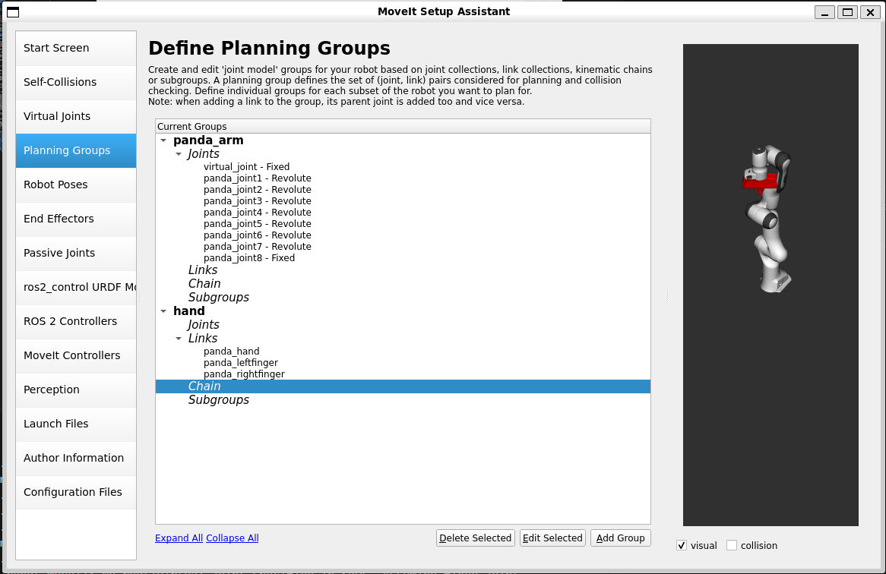
## 4.添加机器人姿势
之后我们可以使用moveit api 使得机器人到达这个位置
设置上次在计划组panda_arm和hand的机器人位姿设计如下
### panda_arm
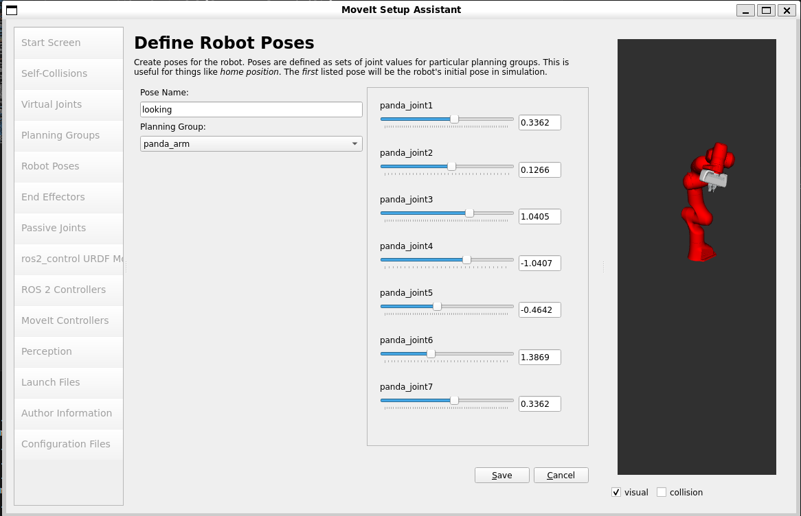
### hand
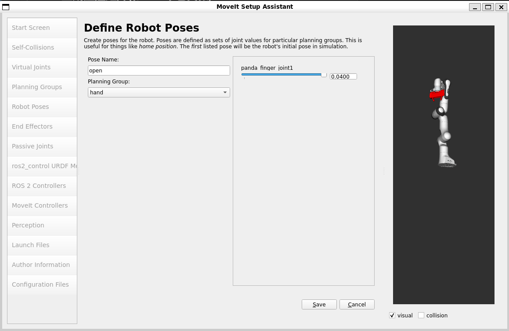
## 5.标记末端执行器
具体设置如下
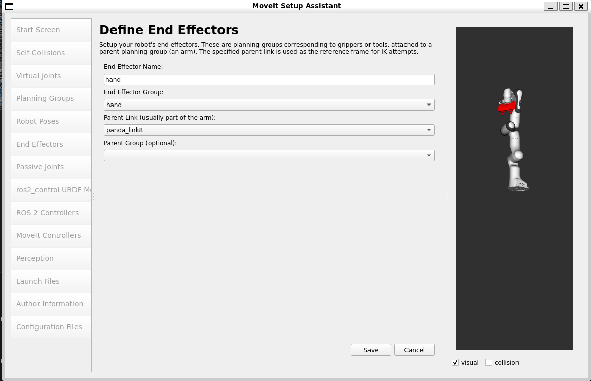
## 6.添加被动关节
在对于这个Panda机械臂来说，没有任何被动关节，所以这个步骤可以跳过
“被动关节”窗格旨在指定机器人中可能存在的任何被动关节。这些关节是非驱动关节，这意味着它们无法直接控制。指定被动关节非常重要，这样规划器才能感知到它们的存在，并避免为其进行规划。如果规划器不知道被动关节的存在，它们可能会尝试规划涉及移动被动关节的轨迹，从而导致规划无效。Panda 机械臂没有任何被动关节，因此我们将跳过此步骤。
## 7.修改ROS2_control URDF
就是把上次的URDF给一个编辑框，也不需要进行编写
## 8.ROS2控制器
操作如下
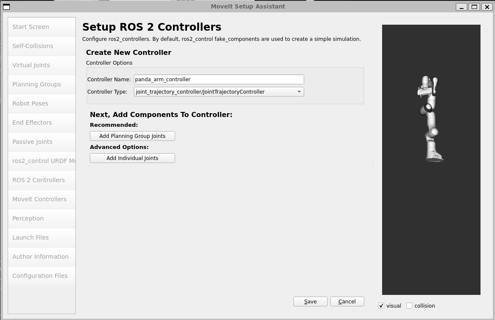
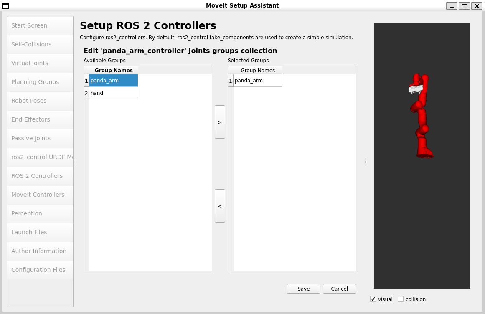
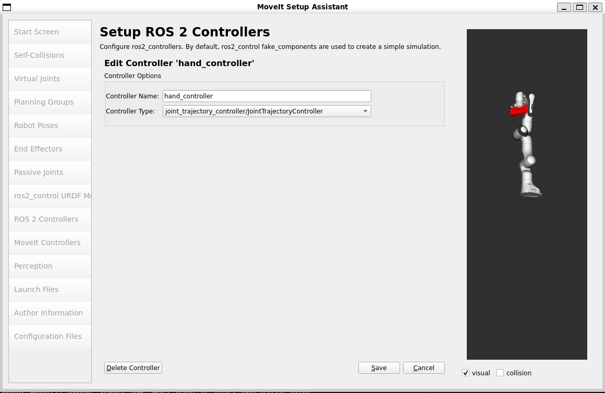
同样也要把配置文件放在规划组下hand
结果如下图所示
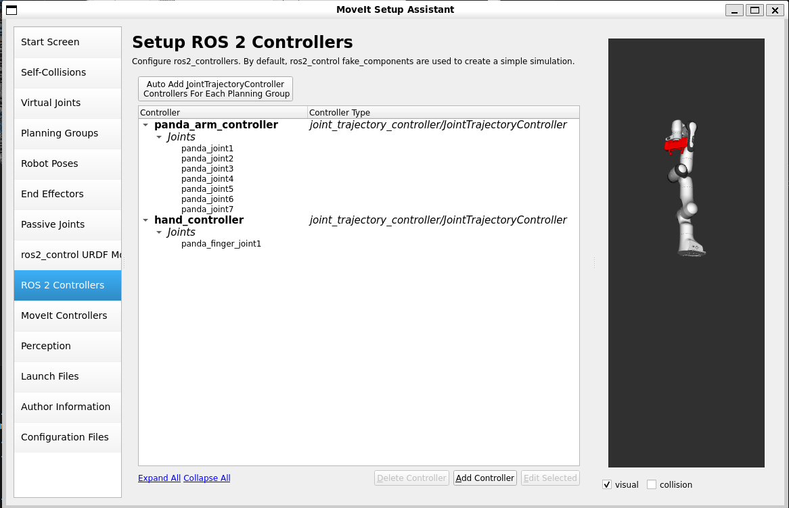
## 9.Moveit控制器
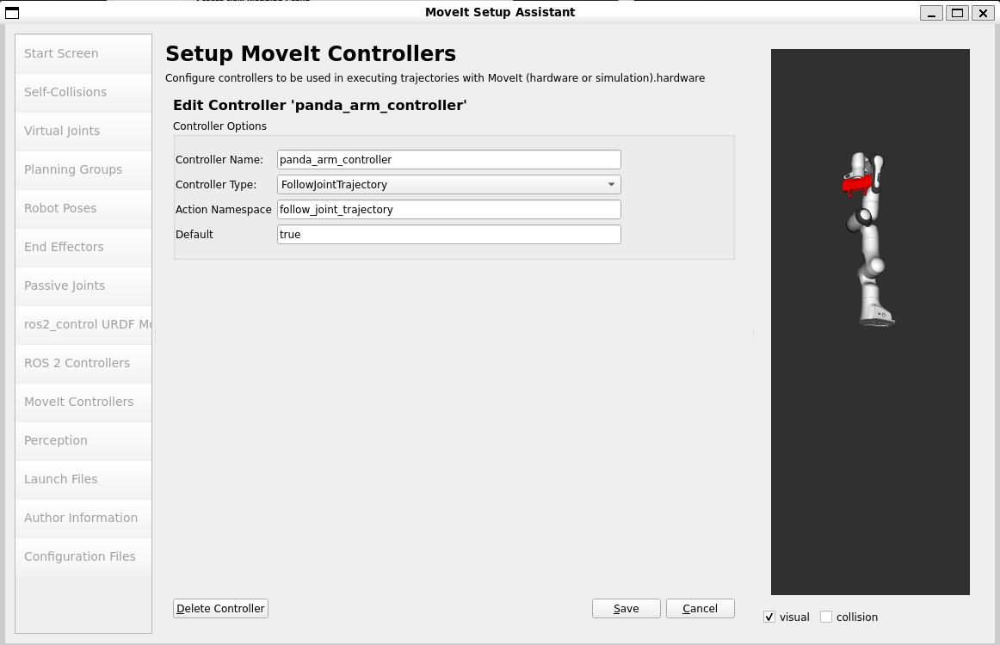
同样也要把配置文件放在规划组下panda_arm
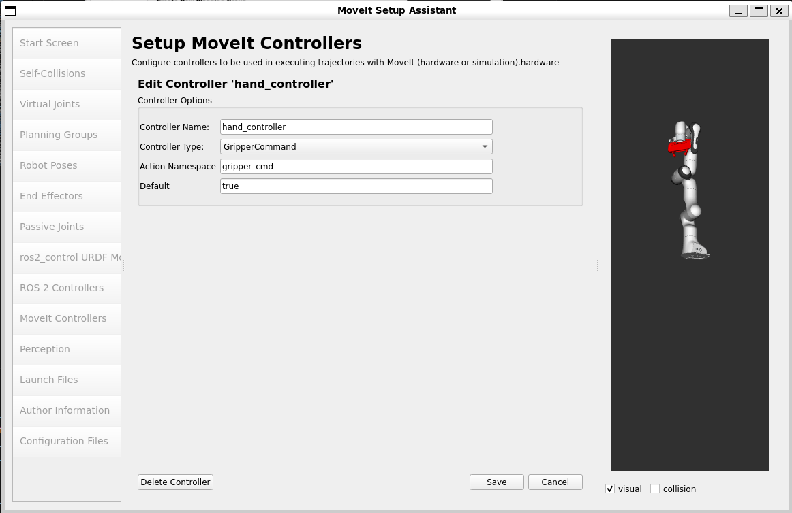
同样也要把配置文件放在规划组下hand
## 10.setup 3D Perception Sensor
设置助手中的“感知”选项卡用于配置机器人使用的 3D 传感器。这些设置保存在名为sensor_3d.yaml的 YAML 配置文件中。
具体可以设置深度相机，或者激光雷达。
如果不需要sensors_3d.yaml ，请选择“无”并继续下一步。
要生成point_cloud配置参数，请参见以下示例：
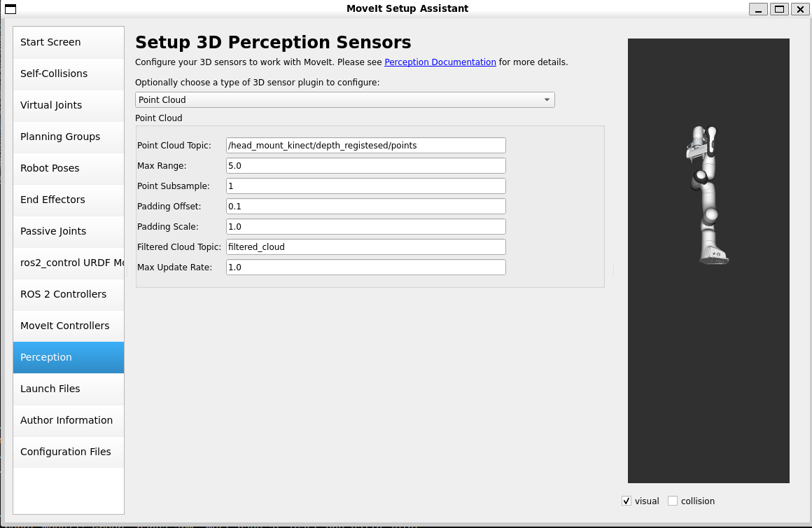
## 11.生成配置文件选择路径
路径：/home/li/moveit_ws/src/panda_moveit_config
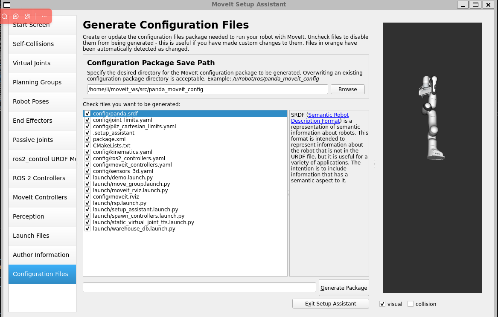
# 下面就开始调试看看我们生成的文件可以被使用不
## 1.设置环境
```bash
cd ~/moveit_ws
colcon build --packages-select panda_moveit_config
source install/setup.zsh
```
## 2.运行panda_moveit_config
```bash
ros2 launch panda_moveit_config demo.launch.py
```
结果如下
<font color="red">[ERROR] [launch]: Caught exception in launch (see debug for traceback): "package 'controller_manager' not found, searching: ['/home/li/moveit_ws/install/panda_moveit_config', '/home/li/Universal_Robots_ROS2_Description/install/ur_description', '/home/li/moveit_ws/install/moveit_resources', '/home/li/moveit_ws/install/moveit_resources_pr2_description', '/home/li/moveit_ws/install/moveit_resources_panda_moveit_config', '/home/li/moveit_ws/install/moveit_resources_panda_description', '/home/li/moveit_ws/install/moveit_resources_fanuc_moveit_config', '/home/li/moveit_ws/install/moveit_resources_fanuc_description', '/opt/ros/humble']
</font>

原因：包缺失

```bash
sudo apt update
sudo apt install ros-humble-controller-manager ros-humble-ros2-control ros-humble-ros2-controllers
```
再次运行生成这个rviz可视化文件结果如图所示证明使用成功

```bash
ros2 launch panda_moveit_config demo.launch.py
```
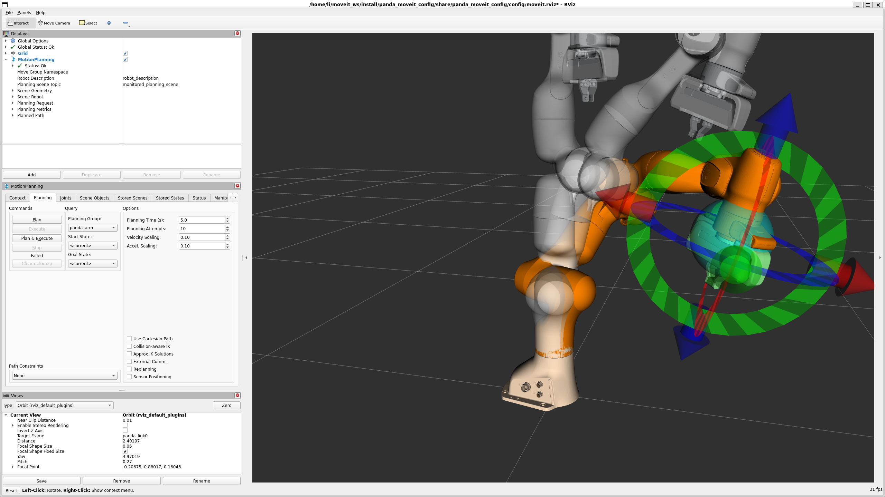
自此：这个moveit的配置文件就可以使用啦


 


