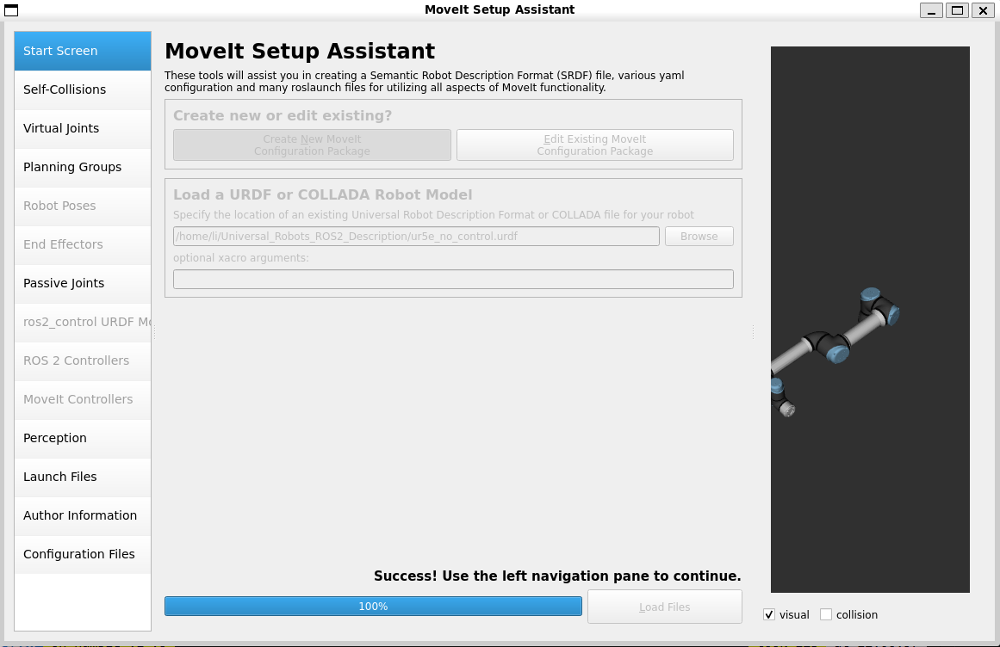
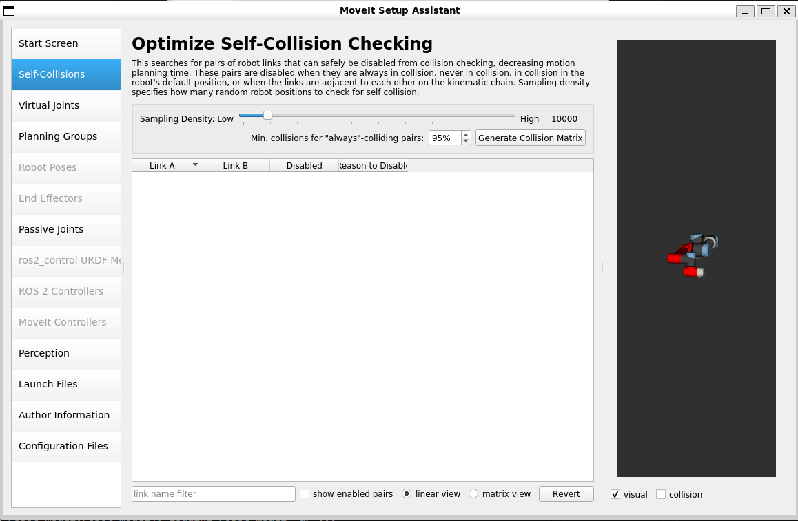
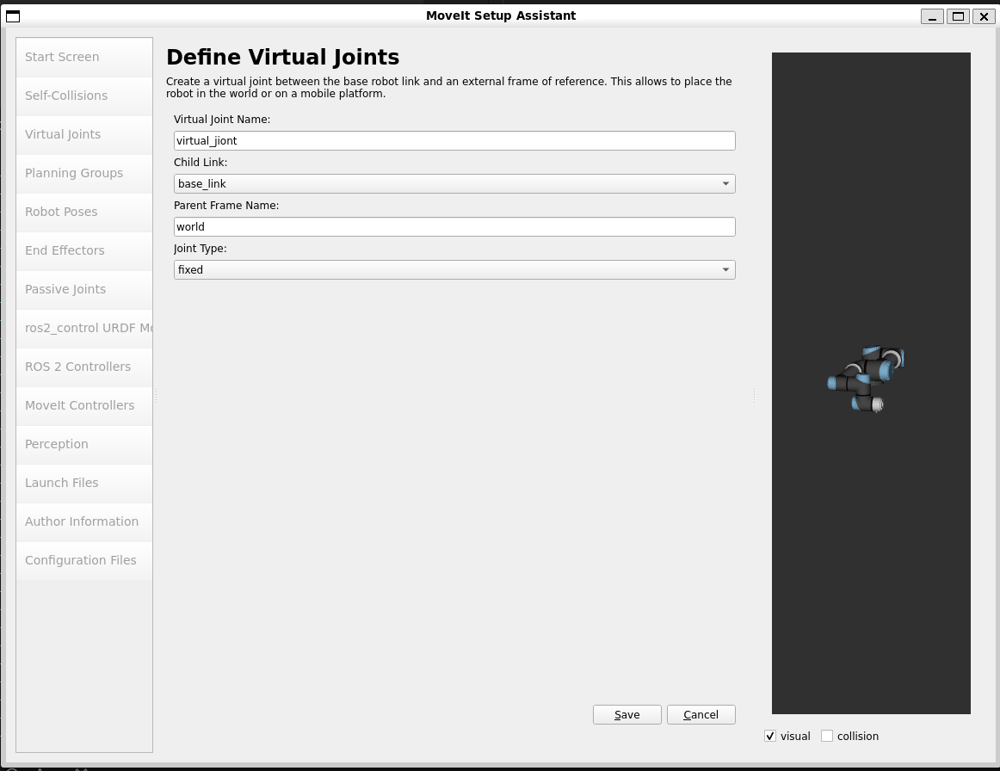
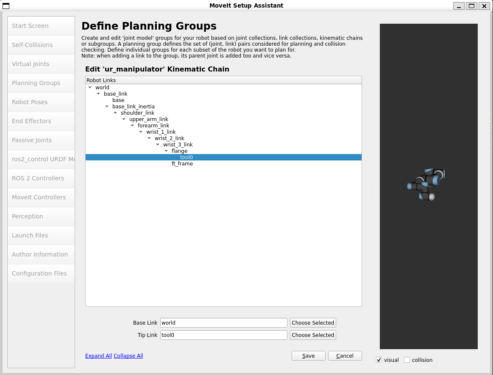

# 本文主要是来使用git clone 出来的一个urdf功能包，然后来操作moveit
参考链接：<https://zhuanlan.zhihu.com/p/1920253906883187153>
## 克隆包的命令
```bash
git clone -b humble https://github.com/UniversalRobots/Universal_Robots_ROS2_Description.git
```
## 构建包并且使用包
放在我们的根目录下啦
之后构建我们的包,并且source工作空间
```bash
colcon build 
source ./install/setup.zsh
# 生成静态urdf文件,禁用机器人控制，否则我们加载这个的时候会导致moveit崩溃
xacro urdf/ur.urdf.xacro ur_type:=ur5e name:=ur generate_ros2_control_tag:=false > ur5e_no_control.urdf
```
## 使用moveit工具
启动moveit工具,这个是moveit官方提供给我们的工具
```bash
ros2 launch moveit_setup_assistant setup_assistant.launch.py
```
### 之后弹出这个弹窗，让我们选择urdf文件


### 选择我们刚刚生成的urdf文件ur5e.urdf，之后点击Load按钮出现这个界面



### 下面我们就可以对moveit进行初始化啦点击self collisions 
选择generate collision matrix 创建碰撞矩阵



### 下一步添加虚拟关节，分成两种情况
#### 一种是固定底座的机器人 
这种不过多描述，可以设置也可以不设置
#### 一种是在小车等移动底座的机器人->点击add virtual joint
设置如下图所示



点击save进入下一步

### 添加计划组->点击add planning group
#### 添加运动链条选择基坐标系和末端坐标系
设置如图



#### 添加关节


问题：使用moveit,现在使用WSL之后出现了闪退的情况,下面切换成树莓派试一下
为了接上这个的文件，我准备使用nfs挂载
# 在WSL上挂载这个目录
```bash
sudo apt update
sudo apt install nfs-kernel-server -y
# 配置/etc/exports 添加这两个目录作为共享目录
echo "/home/li/Universal_Robots_ROS2_Description *(rw,sync,no_root_squash,no_subtree_check)" | sudo tee -a /etc/exports
echo "/home/li/reference *(rw,sync,no_root_squash,no_subtree_check)" | sudo tee -a /etc/exports
# 添加这个配置
sudo exportfs -a && sudo systemctl restart nfs-kernel-server
# 检查nfs的状态
sudo exportfs -v
```
# 在树莓派上挂载这个目录
```bash
sudo apt update
sudo apt install nfs-common -y
# 创建挂载目录
mkdir -p ~/Universal_Robots_ROS2_Description
mkdir -p ~/reference
# 挂载
sudo mount 172.24.231.104:/home/li/Universal_Robots_ROS2_Description ~/Universal_Robots_ROS2_Description
sudo mount 172.24.231.104:/home/li/reference ~/reference
# 发现阻塞
```
结论：WSL不可以通过nfs来连接外部，因为这个虚拟IP只有主机Windows 11可以读取到，树莓派是读取不到的
# 在树莓派上重新运行上面的配置，但是我的树莓派是ROS-Jazzy，只需要将其他的改成ros-jazzy就可以啦
## 使用mobaxterm连接树莓派，发现还是出现这个问题，那就使用树莓派主机试一下
# 在树莓派主机上运行也不可以运行那我就排除了这个问题🤦‍♂️

# 又回到WSL的环境来进行使用
## 使用Franka Emilka Panda (Moveit官方的教程)
```bash
mkdir moveit_ws
cd moveit_ws
git clone -b humble https://github.com/ros-planning/moveit_resources.git
colcon build --symlink-install
source install/setup.zsh
ros2 launch moveit_setup_assistant setup_assistant.launch.py
```
路径选择~/moveit_ws/src/moveit_resources/panda_description/urdf/panda.urdf
但是还是出现这个问题，但是这个是ROS2官方提供的URDF文件，不知道为啥点击Load还是不可以进入内核，我不知道为啥？
### gemini给出的解决方案
```bash
export LIBGL_ALWAYS_SOFTWARE=1
export QT_XCB_GL_INTEGRATION=none
```
### 还是Load在70%的时候闪退，使用antigravity来修复
```bash
export LIBGL_ALWAYS_SOFTWARE=1 && source ~/moveit_ws/install/setup.zsh && /opt/ros/humble/lib/moveit_setup_assistant/moveit_setup_assistant --urdf_path ~/moveit_ws/src/moveit_resources/panda_description/urdf/panda.urdf
```
发现还是Load在70%的时候闪退
参考链接：
<https://blog.csdn.net/Cruelbuildingdog/article/details/153111900>
来试着解决一下这个问题
它给我们的思路比较暴力卸载rviz2降级rviz2的版本来进行操作，可能是rviz2的版本太高了
其中要处理一下rosdep的问题,因为这个问题和我遇见的问题一样
使用前做的准备工作
```bash
sudo apt update
sudo apt install python3-rosdep2
rosdep2 update
```
<font color="red">这里不得不吐槽一下编译速度了🤦‍♂️</font>
感觉超级慢
个人估计大概编译了1 hour，以前在jetson iron nano上使用虚拟内存可以加快编译速度。
扩展虚拟内存可以看这个文章[WSL](./wsl.md)
这样我们就可以加快编译速度啦
按照这个文章操作完之后，


