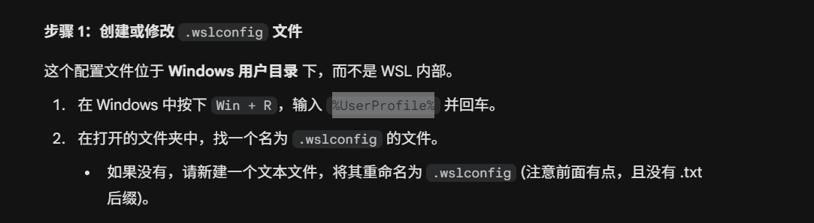
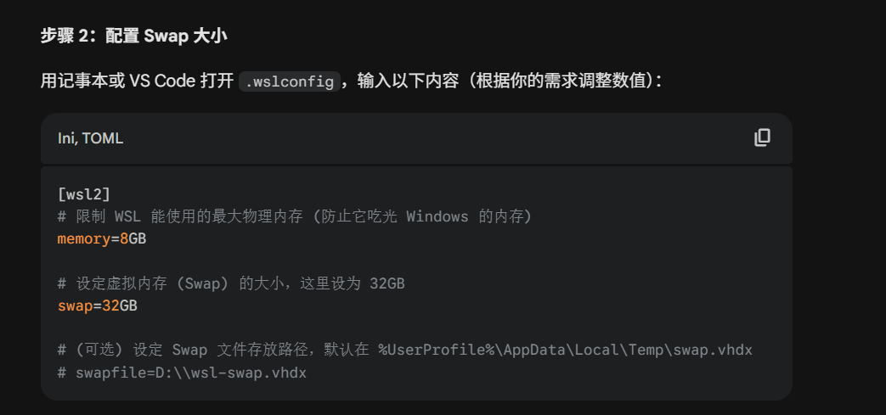

# WSL2 扩展虚拟内存（Swap）指南

在 WSL2 中编译 ROS2 相关包（如 MoveIt、micro-ROS）时，编译速度可能非常慢，甚至因内存不足而中断。通过为 WSL2 配置更大的虚拟内存（Swap）可以有效缓解这一问题。

## 配置步骤

### 第 1 步：进入 Windows 用户主目录

在 Windows 资源管理器地址栏输入 `%USERPROFILE%` 并回车，进入当前 Windows 用户的主目录（如 `C:\Users\YourName`）。



### 第 2 步：创建或编辑 `.wslconfig` 文件

在该目录下新建文件 `.wslconfig`（若已存在则直接编辑），填入以下内容：

```ini
[wsl2]
memory=8GB
swap=32GB
```

- `memory`：WSL2 可使用的最大物理内存，建议不超过宿主机物理内存的 50%。
- `swap`：交换空间大小，建议为物理内存的 2～4 倍，用于应对编译时的内存峰值。



### 第 3 步：重启 WSL2 使配置生效

在 Windows PowerShell 或 CMD 中执行以下命令关闭 WSL2：

```powershell
wsl --shutdown
```

等待数秒后重新打开 WSL 终端，配置即生效。


## 验证配置

在 WSL2 终端中运行以下命令验证内存和交换空间：

```bash
free -h
```

正常情况下应看到类似输出：

```
              total        used        free
Mem:           8.0G         ...          ...
Swap:         32.0G         ...          ...
```

## 进一步优化编译速度

除了扩展虚拟内存，以下方法也可以加快 WSL2 中的编译速度：

### 使用多核并行编译

```bash
# colcon 并行编译，根据 CPU 核心数调整 --parallel-workers
colcon build --symlink-install --parallel-workers 4

# cmake 直接传递并行参数
colcon build --cmake-args -j4
```

### 关闭不必要的 Windows 进程

编译期间关闭杀毒软件对 WSL2 文件系统目录的实时扫描（如 Windows Defender），可显著减少 I/O 等待时间。可在 Windows Defender 中将 WSL2 的 `ext4.vhdx` 文件路径加入排除列表。

### 将代码放在 Linux 文件系统内

避免在 `/mnt/c/` 等 Windows 挂载目录下编译，应将项目放在 `/home/username/` 等 Linux 原生文件系统路径下，I/O 速度差距显著。

## 注意事项

- `.wslconfig` 修改后**必须执行 `wsl --shutdown` 重启**才能生效，仅关闭终端窗口不够。
- 交换空间使用磁盘模拟内存，速度远低于物理内存，配置过大的 swap 而物理内存过小时编译速度仍会很慢，建议优先提升物理内存。
- 此配置对系统中所有 WSL2 发行版生效。

> 本文解决了 [moveit.md](./moveit.md) 中 MoveIt 编译速度慢的问题。
